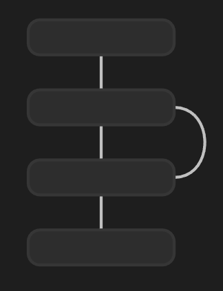
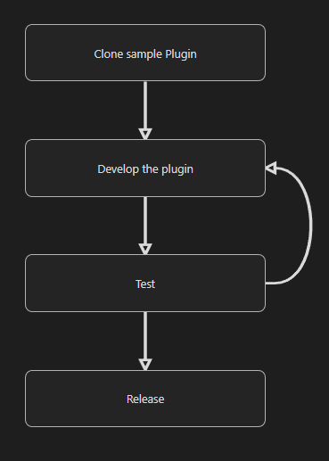

# Better Canvas Embed

This is a plugin for [Obsidian](https://obsidian.md/). It lets you embed a canvas into a note while also showing its content.

## Changes
### Old


### New


## How to use
To use this plugin you have to change the links to a block from this:

```markdown
![[folder/testCanvas.canvas]]
```

to this:
````markdown
```canvas
folder/testCanvas.canvas
```
````

## Install


## Features
- Text nodes
- Edges (Arrows) between two noded